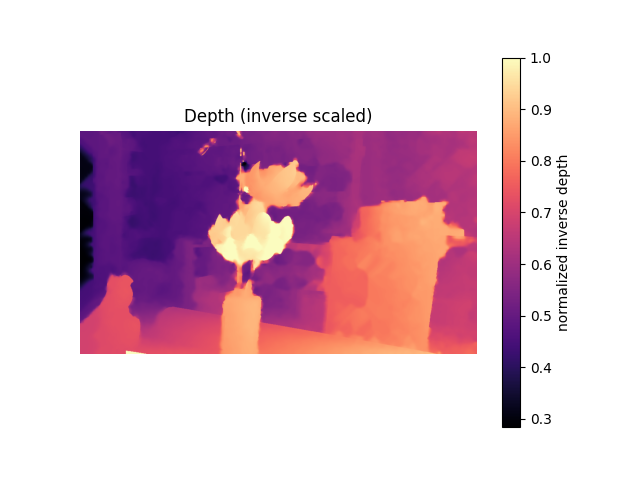
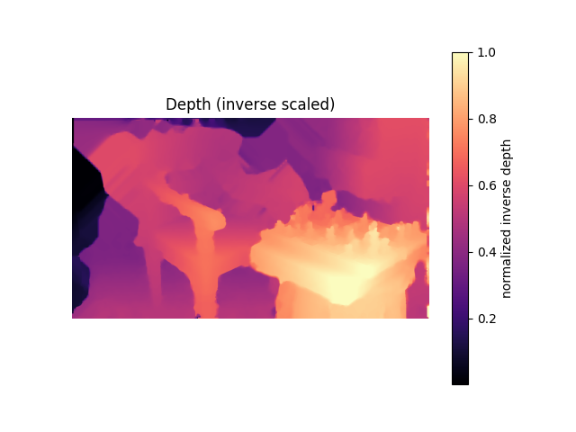

# Stereo Vision Project

A classical stereo vision implementation from scratch in Python, using NumPy and OpenCV (for I/O only). This project creates depth maps and 3D point clouds from stereo image pairs using Semi-Global Matching (SGM) and other classical computer vision algorithms.

|  |  |
|----------|----------|


## Overview

This repository implements a complete stereo vision pipeline that:
- Computes dense disparity maps from rectified stereo image pairs
- Converts disparity to depth using camera calibration
- Generates 3D point clouds from depth maps
- Supports both SAD (Sum of Absolute Differences) and Census transform matching costs
- Features cost volume normalization and confidence-based filtering for improved quality
- Includes advanced post-processing: subpixel refinement, confidence filtering, left-right consistency checking, speckle filtering, bilateral hole filling, and edge-preserving filtering
- Features adaptive SGM penalties based on image gradients for better edge preservation

The implementation is educational and modular, designed to work with Middlebury stereo datasets and prepared for future Structure-from-Motion (SfM) integration for arbitrary image pairs.

## Project Structure

```
stereo_project/
├── core/                   # Core stereo vision algorithms
│   ├── camera.py           # Camera intrinsics, calibration loading (Middlebury)
│   ├── rectification.py    # Image rectification (identity for Middlebury)
│   ├── cost_volume.py      # SAD and Census cost volume computation, normalization, confidence (supports left-to-right and right-to-left)
│   ├── sgm.py              # Semi-Global Matching optimizer with adaptive P2 penalties
│   ├── disparity.py        # Disparity refinement, LR consistency, confidence filtering, speckle filtering, bilateral operations
│   ├── depth.py            # Depth conversion and point cloud generation
│   ├── utils.py            # Utility functions
│   └── sfm/                # SfM scaffolding (for future extension)
│       ├── features.py
│       ├── essential.py
│       ├── pose_estimation.py
│       └── triangulation.py
├── visualization/          # Visualization utilities
│   ├── plots.py            # Disparity and depth map visualization
│   └── pointcloud.py       # 3D point cloud visualization (Open3D/Matplotlib)
└── experiments/            # Example scripts
    └── run_middlebury.py   # End-to-end Middlebury pipeline
```

## How It Works

### Pipeline Overview

1. **Calibration Loading**: Parses Middlebury `calib.txt` to extract camera intrinsics and baseline
2. **Image Loading**: Reads and converts stereo pair to grayscale float32 images
3. **Rectification**: For Middlebury (already rectified), uses identity transformation
4. **Cost Volume**: Builds a 3D cost volume `C[y, x, d]` using either:
   - **SAD**: Sum of Absolute Differences over a window
   - **Census**: Census transform with Hamming distance matching (configurable window size, default 9×9)
   - **Normalization** (optional): Per-pixel min-max normalization to improve discrimination
   - **Confidence computation**: Calculates matching confidence from cost volume
5. **Semi-Global Matching**: Aggregates costs along 8 directions using dynamic programming with smoothness penalties (P1, P2)
   - **Adaptive P2** (optional): Adjusts penalty based on image gradients to preserve depth discontinuities at edges
6. **Disparity Estimation**: Winner-take-all selection followed by subpixel refinement via parabola fitting
7. **Post-Processing** (optional):
   - **Confidence filtering** (optional): Filters low-confidence matches before consistency check
   - **Left-right consistency check**: Validates disparities using right-to-left matching (default threshold: 1.5)
   - **Speckle filtering**: Removes small isolated regions (default max size: 50)
   - **Bilateral hole filling**: Edge-aware interpolation guided by image intensity
   - **Weighted median filter**: Edge-preserving smoothing
   - **Bilateral filter**: Final smoothing while preserving depth edges
8. **Depth Conversion**: Uses `Z = fx * baseline / d` to convert disparity to depth
9. **Point Cloud**: Back-projects depth map to 3D points using pinhole camera model
10. **Visualization**: Displays disparity maps, depth maps, and 3D point clouds

### Key Algorithms

- **Census Transform**: Robust local descriptor comparing pixel intensities to neighbors, encoded as bitstrings. Supports configurable window sizes (default 9×9 for better discrimination in textureless regions)
- **Cost Volume Normalization**: Per-pixel min-max normalization improves discrimination between matches, especially in textureless regions
- **Confidence Computation**: Calculates matching confidence using peak ratio (best vs. second-best cost) to identify reliable matches
- **Semi-Global Matching**: Path-wise cost aggregation that approximates global optimization efficiently. Supports adaptive P2 penalties that reduce at image edges to preserve depth discontinuities
- **Subpixel Refinement**: Quadratic interpolation around the minimum cost for sub-pixel accuracy
- **Confidence-Based Filtering**: Filters out low-confidence matches before consistency checking to preserve only reliable disparities
- **Bilateral Filtering**: Edge-preserving smoothing using joint spatial and intensity weights to maintain depth boundaries while reducing noise
- **Right-to-Left Matching**: Properly implemented cost volume computation for right disparity maps to enable accurate left-right consistency checking

## Installation

### Requirements

- Python 3.11+
- NumPy
- OpenCV (for image I/O and basic operations only)
- Matplotlib (for visualization)
- Open3D (optional, for interactive point cloud visualization)

### Setup

```bash
# Clone the repository
cd Stereo-Vision

# Install dependencies
pip install -r stereo_project/requirements.txt
```

## Usage

### Running the Middlebury Pipeline

The main entry point for Middlebury datasets is `experiments/run_middlebury.py`:

```bash
python -m stereo_project.experiments.run_middlebury \
    --calib path/to/calib.txt \
    --left path/to/im0.png \
    --right path/to/im1.png \
    --max_disparity 190 \
    --method census \
    --census_window 9 \
    --normalize_cost \
    --adaptive_p2 \
    --p1 0.8 \
    --p2 8.0 \
    --confidence_threshold 0.0 \
    --lr_threshold 1.5 \
    --speckle_size 50 \
    --downscale 0.5 \
    --postprocess \
    --save_ply output/output.ply
```

### Arguments

- `--calib`: Path to Middlebury calibration file (`calib.txt`)
- `--left`: Path to left image (e.g., `im0.png`)
- `--right`: Path to right image (e.g., `im1.png`)
- `--max_disparity`: Maximum disparity to search (default: 190)
- `--method`: Matching cost method: `sad` or `census` (default: `census`)
- `--census_window`: Census transform window size, must be odd (default: 9). Larger windows provide better discrimination in textureless regions but are slower
- `--normalize_cost`: Enable per-pixel min-max normalization of cost volume before SGM (improves discrimination)
- `--p1`: SGM penalty for small disparity changes (default: 0.8)
- `--p2`: SGM penalty for large disparity changes (default: 8.0)
- `--adaptive_p2`: Enable gradient-adaptive P2 penalty that reduces at image edges to preserve depth discontinuities
- `--confidence_threshold`: Confidence threshold for filtering low-confidence matches (0.0 = disabled, default: 0.0). Recommended: 0.2-0.3
- `--lr_threshold`: Left-right consistency threshold (default: 1.5). Higher values allow more tolerance
- `--speckle_size`: Maximum speckle size to remove (default: 50). Smaller values remove more noise but may be too aggressive
- `--downscale`: Downscale factor for faster processing (e.g., `0.5`, `0.25`; default: `1.0`)
- `--postprocess`: Enable full post-processing pipeline: confidence filtering, left-right consistency, speckle filtering, bilateral hole filling, weighted median filter, and bilateral filter
- `--save_ply`: Optional path to save point cloud as PLY file

### Example

```bash
python -m stereo_project.experiments.run_middlebury \
    --calib data/middlebury/flower/calib.txt \
    --left data/middlebury/flower/im0.png \
    --right data/middlebury/flower/im1.png \
    --method census \
    --census_window 9 \
    --normalize_cost \
    --adaptive_p2 \
    --lr_threshold 2.0 \
    --speckle_size 100 \
    --downscale 0.5 \
    --postprocess \
    --save_ply output/output.ply
```

The script will:
- Print detailed timing and statistics for each stage
- Display disparity and depth maps using matplotlib
- Optionally save a PLY point cloud file
- Show point cloud visualization (if Open3D is available)

### Viewing PLY Point Clouds

To view a saved PLY file, use the simple viewer:

```bash
python -m stereo_project.experiments.view_ply output/output.ply
```

The viewer will:
- Load the point cloud and display statistics
- Open an interactive 3D viewer (Open3D if available, or matplotlib as fallback)
- Allow you to rotate and zoom the point cloud

### Running on Custom Image Pairs

For arbitrary image pairs (not pre-rectified), use the SfM-based pipeline:

```bash
python -m stereo_project.experiments.run_sfm_stereo_pair \
    --left path/to/left.jpg \
    --right path/to/right.jpg \
    --intrinsics output/camera_intrinsics.txt \
    --max_disparity 128 \
    --method census \
    --census_window 7 \
    --normalize_cost \
    --lr_threshold 2.0 \
    --speckle_size 100 \
    --downscale 0.5 \
    --save_ply output/output.ply
```

**Note on Custom Images**: The pipeline can process custom stereo pairs using Structure-from-Motion (SfM) to estimate relative pose and perform rectification. However, **results on custom images are often poor** due to:

- **Image capture requirements**: Custom images must be taken with proper stereo setup (parallel cameras, appropriate baseline, good lighting, sufficient texture)
- **Disparity range limitations**: The current implementation has a fixed maximum disparity search range (`--max_disparity`). Custom images often have much larger disparity ranges than the program can handle, leading to incomplete or incorrect depth maps
- **Rectification quality**: SfM-based rectification depends on feature matching quality, which can be poor in low-texture or poorly captured images

For best results, use professionally captured and calibrated stereo pairs (like Middlebury datasets) or ensure custom images are captured with:
- Parallel camera setup
- Appropriate baseline (not too wide, not too narrow)
- Good lighting and texture
- Minimal lens distortion
- Disparity ranges within the specified `--max_disparity` limit

**Recommended settings for best quality (Middlebury datasets):**
- Use `--method census` with `--census_window 9` for robust matching
- Enable `--normalize_cost` to improve cost volume discrimination (highly recommended)
- Enable `--adaptive_p2` for better edge preservation (highly recommended)
- Use `--lr_threshold 1.5` (default) for balanced consistency checking, or `2.0` if many valid pixels are being invalidated
- Use `--speckle_size 50` (default) to remove noise, or `100` if valid regions are being removed
- Optionally use `--confidence_threshold 0.2` or `0.3` to filter uncertain matches (start with 0.0 to see all matches)
- Use `--downscale 0.75` or `1.0` for maximum detail (slower but better quality)
- Always use `--postprocess` for production-quality results

## Advanced Features

### Cost Volume Normalization
Per-pixel min-max normalization of the cost volume improves discrimination between matches, especially in textureless regions where raw costs may have similar magnitudes. This helps SGM make better decisions and reduces patchiness in the final disparity map.

### Confidence-Based Filtering
The pipeline computes matching confidence from the cost volume using the peak ratio method (best vs. second-best cost). Low-confidence matches can be filtered out before consistency checking, preserving only reliable disparities and reducing artifacts.

### Adaptive SGM Penalties
The pipeline supports gradient-adaptive P2 penalties that automatically reduce at image edges, allowing depth discontinuities while maintaining smoothness in textureless regions. This significantly improves edge preservation in the final disparity map.

### Enhanced Post-Processing
The post-processing pipeline includes multiple stages:
- **Confidence filtering**: Optional filtering of low-confidence matches
- **Left-right consistency**: Validates disparities with relaxed threshold (default 1.5) for better pass rates
- **Speckle filtering**: Removes small isolated regions (default max size: 50)
- **Bilateral hole filling**: Edge-aware interpolation that respects image boundaries
- **Weighted median filter**: Removes noise while preserving depth edges
- **Bilateral filter**: Final smoothing that maintains object boundaries

### Right-to-Left Matching
Properly implemented right-to-left cost volume computation enables accurate left-right consistency checking, filtering out inconsistent matches and improving overall quality.

## Known Limitations and Tips

### Custom Image Limitations

**Important**: This pipeline works best with professionally captured and calibrated stereo pairs (e.g., Middlebury datasets). Custom images often produce poor results due to:

1. **Disparity range**: Custom images frequently have disparity ranges that exceed the program's maximum search limit (`--max_disparity`), resulting in incomplete depth maps
2. **Capture quality**: Images not taken with proper stereo setup (parallel cameras, appropriate baseline, good lighting) will produce poor results
3. **Rectification accuracy**: SfM-based rectification depends on feature matching, which can fail on low-texture or poorly captured images
4. **Calibration**: Accurate camera intrinsics are required; estimated or incorrect intrinsics lead to poor depth estimation

The pipeline is designed primarily for research-quality stereo datasets. For custom images, ensure proper stereo capture setup and that the disparity range is within the specified limits.

### Remaining Invalid Regions (0-Value Patches)
Some pixels may remain invalid (disparity = 0) after post-processing, typically due to:

1. **Occlusions**: Regions visible in one view but not the other, especially at object boundaries
2. **Large textureless regions**: Areas with insufficient texture for reliable matching
3. **Border effects**: Image boundaries where matching is limited
4. **Hole filling limitations**: Very large holes may exceed the filling window size
5. **Disparity range exceeded**: Pixels with disparity beyond `--max_disparity` will remain invalid

### Tips for Improving Results

**To reduce invalid regions:**
- Increase `--lr_threshold` to 2.0 or 2.5 for more lenient consistency checking
- Increase `--speckle_size` to 100 if valid regions are being removed
- Process at higher resolution (`--downscale 0.75` or `1.0`) for more detail
- Use `--confidence_threshold 0.2` to filter only the most uncertain matches

**For better quality:**
- Always use `--normalize_cost` for improved discrimination
- Enable `--adaptive_p2` for better edge preservation
- Use `--census_window 9` or larger for textureless regions
- Process at full resolution when possible for maximum detail

**Performance vs. Quality trade-offs:**
- Lower `--downscale` values (0.25, 0.5) for faster processing but less detail
- Smaller `--census_window` (7) is faster but less robust
- Disable `--postprocess` for faster results but lower quality

## Design Principles

- **No OpenCV Stereo Functions**: All stereo matching, SGM, and depth computation are implemented from scratch using NumPy
- **Modular Architecture**: Clean separation of concerns for easy extension
- **Educational Focus**: Comments explain key formulas and algorithms
- **SfM-Ready**: Scaffolding in `core/sfm/` for future Structure-from-Motion integration

## Structure-from-Motion (SfM) Support

The project includes a two-view SfM implementation to support arbitrary image pairs:
- Feature detection and matching (ORB)
- Essential matrix estimation (normalized 8-point algorithm with RANSAC)
- Pose recovery (R, t) with cheirality checking
- Stereo rectification from estimated pose

The SfM pipeline is implemented in `core/sfm/` and can be used via `experiments/run_sfm_stereo_pair.py`. However, **results on custom images are often poor** due to the limitations mentioned above. The SfM implementation is functional but works best with well-captured stereo pairs that have appropriate disparity ranges and good texture.

## License

See LICENSE file for details.
